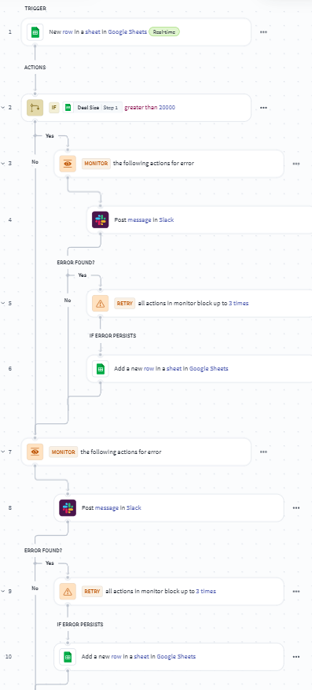
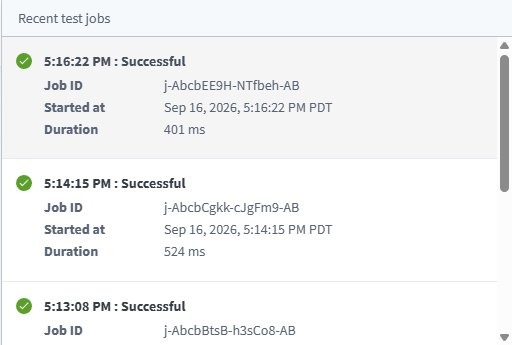
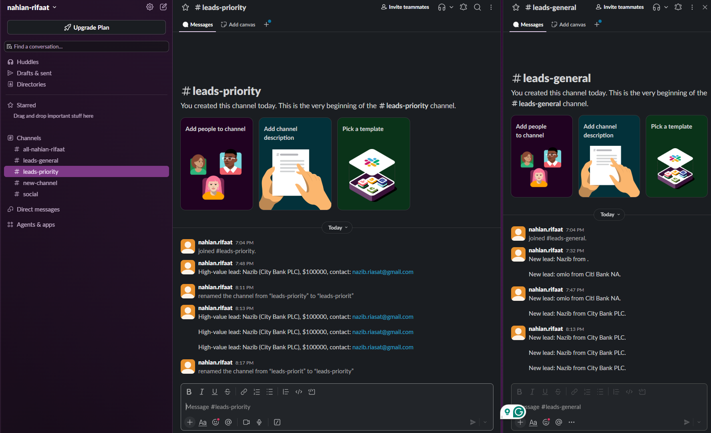

# Sales Lead Router (Workato)

A small automation integration recipe built to solve a problem every sales team runs into: leads sitting in a spreadsheet don't get noticed fast enough, and high-value ones get missed in the noise.

## The problem

A sales team collects leads in a Google Sheet. Someone has to check it, notice which leads are worth prioritizing, and manually ping the right people. That works fine for a handful of rows a day, but it doesn't scale, and it's easy for a big deal to sit unread for hours.

## The solution

A Workato recipe that watches a Google Sheet for new leads and automatically routes them to the right Slack channel based on deal size:

- **Trigger:** new row added to the Leads sheet
- **Logic:** if Deal Size > $20,000 → post to `#leads-priority` with a highlighted message; otherwise → post to `#leads-general`
- **Reliability:** if the Slack post fails (rate limit, timeout, etc.), the recipe retries automatically. If it still fails after retries, the lead and the error get logged to a separate Error Log sheet instead of silently disappearing.

## Screenshots

| Recipe flow | Job history | Slack output |
|---|---|---|
|  |  |  |

## Stack

- Workato free version (trigger, conditional logic, error handling/retries)
- Google Sheets (data source + error log)
- Slack free (notification target)
